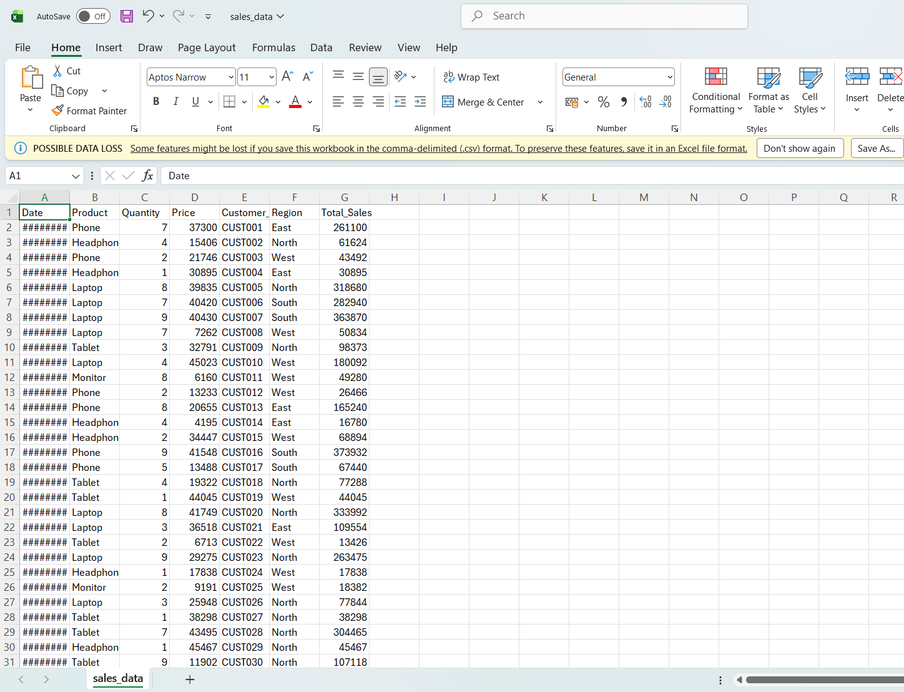
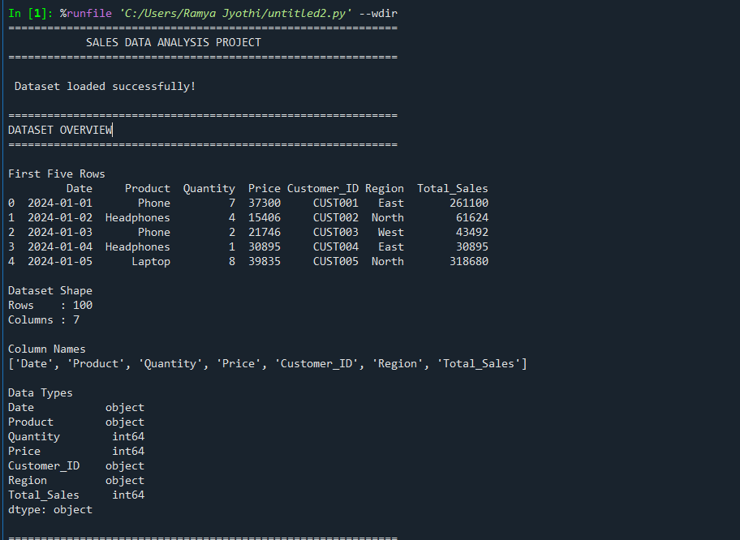
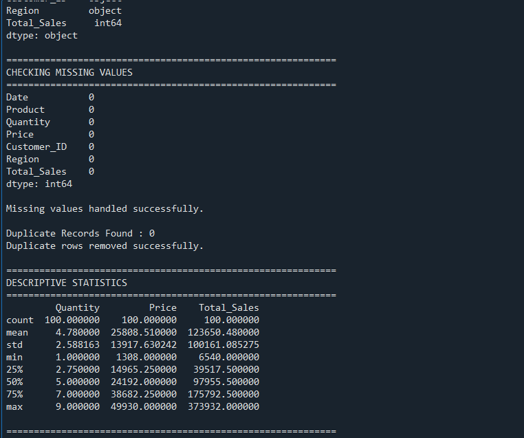
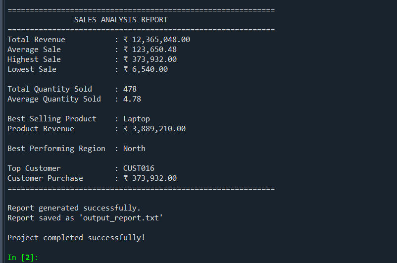
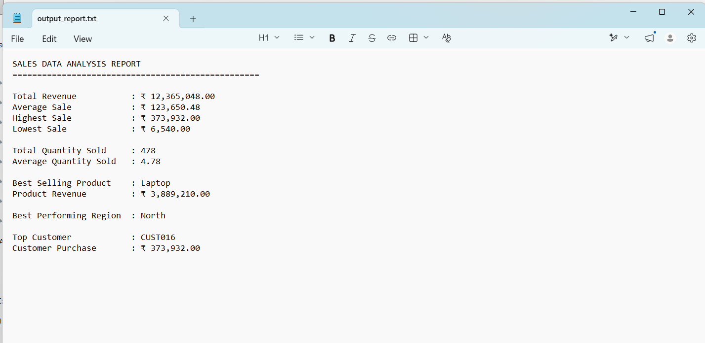

# Sales Data Analysis using Python and Pandas

**Author:** Bammidi Ramya Jyothi               
**Internship Week:** Week 3 – Introduction to Data Analysis – Working with Real Data  
**Programming Language:** Python  
**Development Environment:** Spyder (Anaconda)  
**Library Used:** Pandas  
**Dataset:** sales_data.csv  

---

# Project Objective

The objective of this project is to analyze a sales dataset using Python and the Pandas library. The project demonstrates the complete data analysis workflow, including loading the dataset, exploring its structure, cleaning missing and duplicate values, performing statistical analysis, and generating meaningful business insights.

The project aims to identify important business metrics such as total revenue, average sales, highest and lowest sales, total quantity sold, best-selling product, top customer, and best-performing region. It also provides practical experience in using the Pandas library for real-world data analysis tasks and enhances programming skills through hands-on implementation.

---

# Project Overview

## Introduction

Data analysis is the process of collecting, organizing, cleaning, transforming, and interpreting data to discover meaningful information that supports effective decision-making. Organizations across various industries generate large volumes of data every day. Analyzing this data helps businesses understand customer behavior, monitor sales performance, identify trends, and make informed business decisions.

This project focuses on analyzing a sales dataset using Python and the Pandas library. Pandas is one of the most popular libraries for data analysis because it provides powerful data structures and functions that simplify working with structured datasets.

The project begins by loading the sales dataset from a CSV file into a Pandas DataFrame. The dataset is then explored to understand its structure, including the number of records, columns, and data types. After exploring the data, cleaning operations are performed to handle missing values and remove duplicate records, thereby improving data quality.

Once the dataset is cleaned, various statistical calculations and business metrics are generated. These include total revenue, average sales, highest sale, lowest sale, total quantity sold, best-selling product, best-performing region, and top customer. Finally, the program displays a well-formatted sales report in the Spyder console and saves the report to a text file.

This project demonstrates the complete lifecycle of a simple data analysis task and provides practical experience in handling real-world business datasets using Python and Pandas.

---

# Project Objectives

The major objectives of this project are:

- Understand the fundamentals of data analysis.
- Learn to work with CSV datasets using Python.
- Gain practical experience using the Pandas library.
- Explore and understand dataset structure.
- Identify and handle missing values.
- Remove duplicate records to improve data quality.
- Perform descriptive statistical analysis.
- Calculate important business metrics.
- Generate a formatted sales report.
- Strengthen Python programming and analytical skills.

---

# Dataset Description

The project uses a dataset named **sales_data.csv**, which contains sales transaction records collected from different customers, products, and regions.

Each row in the dataset represents a single sales transaction, while each column contains specific information related to that transaction.

## Dataset Information

| Attribute | Details |
|-----------|---------|
| Dataset Name | sales_data.csv |
| File Format | CSV (Comma Separated Values) |
| Number of Records | Approximately 100 |
| Number of Columns | 7 |

### Dataset Columns

| Column Name | Description |
|-------------|-------------|
| Date | Date of the sales transaction |
| Product | Product sold |
| Quantity | Number of units sold |
| Price | Price per unit |
| Customer | Customer ID or customer name |
| Region | Sales region |
| Total_Sales | Total revenue generated |

The dataset provides sufficient information to perform exploratory data analysis and calculate useful business metrics that help evaluate sales performance.

---

# Technologies Used

The following technologies and software were used in the development of this project.

| Technology | Purpose |
|------------|---------|
| Python | Programming language used to implement the project |
| Pandas | Library used for data manipulation and analysis |
| Spyder (Anaconda) | Integrated Development Environment used to write and execute the program |
| CSV | Format used for storing the sales dataset |
| GitHub | Used for project submission and version control |

## Python

Python is a high-level, interpreted programming language known for its simple syntax and powerful libraries. It is widely used in data analysis, machine learning, artificial intelligence, and automation.

## Pandas

Pandas is an open-source Python library that provides efficient data structures such as DataFrames and Series. It simplifies tasks such as loading datasets, cleaning data, statistical analysis, grouping, filtering, and report generation.

## Spyder (Anaconda)

Spyder is an open-source Integrated Development Environment (IDE) included with the Anaconda distribution. It provides an interactive Python console, a Variable Explorer, debugging tools, syntax highlighting, and an easy-to-use interface for developing Python programs. The project was developed, executed, and tested using Spyder.

## CSV

CSV (Comma Separated Values) is a simple text-based file format used to store tabular data. It is lightweight, easy to manage, and supported by almost every data analysis tool.

## GitHub

GitHub is a cloud-based platform used for version control and project hosting. It allows developers to maintain project history, collaborate with others, and share source code repositories efficiently.

---
# Setup Instructions

Follow the steps below to set up and execute the Sales Data Analysis project successfully.

## Step 1: Install Python

Download and install the latest version of Python from the official Python website if it is not already installed on your computer.

---

## Step 2: Install Anaconda

Download and install the Anaconda Distribution, which includes the Spyder IDE along with essential Python libraries for data analysis.

---

## Step 3: Install Required Libraries

Navigate to the project directory and install the required Python libraries by executing the following command:

```bash
pip install -r requirements.txt
```

The `requirements.txt` file contains the necessary dependencies required to run the project.

---

## Step 4: Open Spyder

Launch **Spyder IDE** from the Anaconda Navigator or directly from your system.

---

## Step 5: Open the Project

Open the **sales_analysis.py** file in Spyder.

Ensure that the following files are placed inside the same project folder:

- sales_analysis.py
- sales_data.csv
- analysis_report.md
- requirements.txt

---

## Step 6: Execute the Program

Click the **Run** button (▶) in Spyder or press **F5** to execute the Python program.

---

## Step 7: View the Output

After successful execution, the program will:

- Load the sales dataset.
- Display dataset information.
- Perform data cleaning.
- Calculate business metrics.
- Display the formatted sales report in the Spyder Console.
- Generate an `output_report.txt` file containing the analysis report.

---

# Project Folder Structure

The project follows a simple and organized folder structure to improve readability and maintainability.

```

Sales_Data_Analysis/
│
├── sales_analysis.py
├── sales_data.csv
├── analysis_report.md
├── requirements.txt
├── output_report.txt
└── screenshots/
    ├── dataset.png
    ├── output_report.png
    ├── program_output1.png
    ├── program_output2.png
    └── sales_report.png
```

Each file in the project serves a specific purpose.

| File Name | Description |
|------------|-------------|
| sales_analysis.py | Main Python program for data analysis |
| sales_data.csv | Dataset used for analysis |
| analysis_report.md | Project documentation |
| requirements.txt | Required Python libraries |
| output_report.txt | Generated sales report |
| screenshots | Folder containing project screenshots |

---

# Code Structure

The Python program is organized into multiple logical sections to improve readability, maintenance, and debugging.

## 1. Import Libraries

The program begins by importing the required Python libraries.

The Pandas library is imported for reading, cleaning, manipulating, and analyzing the sales dataset.

---

## 2. Load Dataset

The CSV dataset is loaded into a Pandas DataFrame using the `read_csv()` function.

The program also verifies whether the dataset is successfully loaded before proceeding with further analysis.

---

## 3. Explore the Dataset

Once the dataset is loaded, the following information is displayed:

- First five rows of the dataset
- Dataset dimensions
- Number of rows
- Number of columns
- Column names
- Data types of each column

This step provides an overview of the dataset and helps understand its structure.

---

## 4. Data Cleaning

Before analysis, the dataset is cleaned to improve data quality.

The following cleaning operations are performed:

- Identify missing values.
- Replace missing numerical values with the mean.
- Replace missing text values with **"Unknown"**.
- Remove duplicate records.
- Validate the cleaned dataset.

These operations ensure that inaccurate or incomplete data does not affect the analysis results.

---

## 5. Statistical Analysis

The program calculates descriptive statistics for the numerical columns.

The following statistical measures are generated:

- Count
- Mean
- Standard Deviation
- Minimum
- Maximum
- Quartiles

These statistics provide a summary of the dataset and help understand the distribution of numerical values.

---

## 6. Sales Analysis

The cleaned dataset is analyzed to calculate important business metrics.

The program computes:

- Total Revenue
- Average Sales
- Highest Sale
- Lowest Sale
- Total Quantity Sold
- Average Quantity Sold
- Best Selling Product
- Product Revenue
- Best Performing Region
- Top Customer

These metrics help evaluate the overall business performance.

---

## 7. Report Generation

After completing the analysis, the program generates a well-formatted sales report.

The report is displayed in the Spyder Console and also saved as **output_report.txt** for future reference.

---

# Data Cleaning Process

Data cleaning is a crucial step in any data analysis project because incorrect or incomplete data can lead to inaccurate results.

The following data cleaning operations were performed:

### Missing Value Detection

The program checks every column to identify missing values using the `isnull()` function.

---

### Handling Missing Values

If numerical columns contain missing values, they are replaced with the average value of the respective column.

If categorical columns contain missing values, they are replaced with the value **"Unknown"**.

---

### Duplicate Record Removal

Duplicate rows are identified using the `duplicated()` function.

All duplicate records are removed using the `drop_duplicates()` function to maintain data consistency.

---

### Data Validation

After cleaning, the dataset is checked again to ensure that:

- Missing values have been handled.
- Duplicate records have been removed.
- Dataset integrity is maintained.

---

# Data Analysis Workflow

The project follows a systematic workflow for analyzing the sales dataset.

1. Import required libraries.
2. Load the CSV dataset.
3. Explore dataset structure.
4. Identify missing values.
5. Clean the dataset.
6. Remove duplicate records.
7. Perform descriptive statistical analysis.
8. Group data by Product, Region, and Customer.
9. Calculate business metrics.
10. Display the formatted sales report.
11. Save the report to a text file.

This workflow ensures that the analysis is organized, reproducible, and easy to understand.

---
# Metrics Calculated

The project calculates several important business metrics that help evaluate the sales performance of the organization. These metrics provide meaningful insights into revenue generation, customer purchasing behavior, product performance, and regional sales distribution.

The following metrics were calculated:

| Metric | Description |
|---------|-------------|
| Total Revenue | Sum of all sales transactions |
| Average Sales | Average revenue generated per transaction |
| Highest Sale | Maximum sales value recorded |
| Lowest Sale | Minimum sales value recorded |
| Total Quantity Sold | Total number of products sold |
| Average Quantity Sold | Average quantity sold per transaction |
| Best Selling Product | Product generating the highest revenue |
| Product Revenue | Revenue generated by the best-selling product |
| Best Performing Region | Region contributing the highest sales |
| Top Customer | Customer with the highest purchase value |
| Customer Purchase Value | Total purchase amount of the top customer |

These metrics help businesses evaluate performance and identify areas for improvement.

---

# Technical Details

## Overview

The project has been developed using Python and the Pandas library. Pandas provides efficient data structures and functions for manipulating and analyzing structured datasets.

The application reads sales information from a CSV file, processes the data, performs cleaning operations, calculates business metrics, and finally generates a formatted report.

---

## Algorithm

The project follows the algorithm given below:

1. Import the Pandas library.
2. Load the CSV dataset into a DataFrame.
3. Display dataset information.
4. Check dataset dimensions.
5. Display column names and data types.
6. Detect missing values.
7. Replace missing numerical values using the column mean.
8. Replace missing categorical values with **"Unknown"**.
9. Remove duplicate records.
10. Generate descriptive statistics.
11. Calculate Total Revenue.
12. Calculate Average Sales.
13. Calculate Highest Sale.
14. Calculate Lowest Sale.
15. Calculate Total Quantity Sold.
16. Group sales by Product.
17. Identify the Best Selling Product.
18. Group sales by Region.
19. Identify the Best Performing Region.
20. Group sales by Customer.
21. Identify the Top Customer.
22. Display the formatted sales report.
23. Save the report into **output_report.txt**.

---

## Data Structures Used

The project uses the following data structures:

### Pandas DataFrame

The DataFrame is the primary data structure used in the project. It stores the sales dataset in a tabular format consisting of rows and columns.

### Pandas Series

Series objects are used when selecting individual columns from the DataFrame for performing calculations and aggregations.

### Python Variables

Variables are used to store calculated metrics such as:

- Total Revenue
- Average Sales
- Highest Sale
- Lowest Sale
- Total Quantity Sold
- Best Selling Product
- Best Region
- Top Customer

### GroupBy Objects

The `groupby()` function is used to group the dataset based on:

- Product
- Region
- Customer

This enables efficient aggregation and calculation of business metrics.

---

# Project Architecture

The overall workflow of the project is illustrated below.

```

Sales CSV File
│
▼
Load Dataset using Pandas
│
▼
Explore Dataset
│
▼
Check Missing Values
│
▼
Data Cleaning
│
▼
Remove Duplicate Records
│
▼
Statistical Analysis
│
▼
Business Metrics Calculation
│
▼
Generate Sales Report
│
▼
Save Report (output_report.txt)

```

This architecture demonstrates the sequential flow of data throughout the project.

---

# Analysis Findings

The analysis of the sales dataset produced several valuable business insights.

### Revenue Analysis

The program successfully calculated the total revenue generated from all sales transactions. This metric provides an overview of the company's overall sales performance.

---

### Sales Distribution

The average sales value indicates the typical revenue generated per transaction. The highest and lowest sales values help identify unusually large or small transactions.

---

### Product Performance

The project identified the product contributing the highest overall revenue. This information helps businesses understand customer demand and optimize inventory planning.

---

### Regional Performance

The analysis identified the region generating the maximum sales revenue. This information can assist management in evaluating regional market performance and planning future marketing strategies.

---

### Customer Analysis

The customer who contributed the highest purchase value was identified. Such information is useful for customer relationship management and loyalty programs.

---

### Overall Business Insights

Based on the analysis, the project successfully demonstrates how sales data can be transformed into meaningful business information using Python and the Pandas library.

---

# Testing Evidence

The project was tested at every stage to ensure that each functionality worked correctly.

| Test Case | Expected Result | Status |
|------------|----------------|--------|
| CSV file loaded successfully | Dataset should load without errors | ✅ Passed |
| Dataset shape displayed | Correct number of rows and columns displayed | ✅ Passed |
| Column names displayed | All dataset columns displayed correctly | ✅ Passed |
| Data types displayed | Appropriate data types identified | ✅ Passed |
| Missing values detected | Missing values displayed correctly | ✅ Passed |
| Missing values handled | Missing values replaced successfully | ✅ Passed |
| Duplicate records removed | Duplicate rows removed | ✅ Passed |
| Statistical summary generated | Descriptive statistics displayed | ✅ Passed |
| Total Revenue calculated | Correct revenue generated | ✅ Passed |
| Average Sales calculated | Average sales displayed correctly | ✅ Passed |
| Highest Sale calculated | Maximum sales value identified | ✅ Passed |
| Lowest Sale calculated | Minimum sales value identified | ✅ Passed |
| Best Selling Product identified | Product with highest revenue displayed | ✅ Passed |
| Best Performing Region identified | Region with highest sales displayed | ✅ Passed |
| Top Customer identified | Customer with highest purchase displayed | ✅ Passed |
| Sales report generated | Report displayed successfully | ✅ Passed |
| Report saved | output_report.txt created successfully | ✅ Passed |

The successful completion of all test cases confirms that the project performs as expected and produces reliable results.

---
# Screenshots

The following screenshots demonstrate the successful execution of the project and provide visual evidence of the implementation.

---

## Screenshot 1: Sales Dataset

The screenshot below shows the **sales_data.csv** dataset opened in Microsoft Excel.



---

## Screenshot 2: Program Execution – Dataset Overview

This screenshot shows the successful loading of the dataset and the display of dataset information such as rows, columns, data types, and missing values.



---

## Screenshot 3: Program Execution – Sales Analysis

This screenshot displays the calculated statistics and business metrics generated by the Python program.



---

## Screenshot 4: Final Sales Report

The following screenshot shows the final sales analysis report generated by the Python program.



---

## Screenshot 5: Generated Output Report

The screenshot below shows the generated `output_report.txt` file containing the formatted sales analysis report.



---

# Challenges Faced

During the development of this project, a few challenges were encountered. These challenges provided valuable learning opportunities and helped improve problem-solving skills.

Some of the major challenges included:

- Understanding the structure and contents of the dataset.
- Handling missing values appropriately without affecting the analysis.
- Identifying and removing duplicate records.
- Performing grouping and aggregation using Pandas.
- Calculating meaningful business metrics from raw sales data.
- Formatting the console output into a readable report.
- Debugging minor issues related to column names and dataset formatting.
- Organizing the project files according to the required GitHub structure.

Each challenge was resolved by carefully studying the Pandas documentation, testing different approaches, and validating the program output.

---

# Learning Outcomes

This project provided practical exposure to the complete data analysis workflow using Python and the Pandas library.

The key learning outcomes include:

- Understanding the fundamentals of data analysis.
- Reading and processing CSV files using Python.
- Working with Pandas DataFrames and Series.
- Exploring datasets using built-in Pandas functions.
- Handling missing values and duplicate records.
- Performing descriptive statistical analysis.
- Applying grouping and aggregation techniques.
- Calculating business performance metrics.
- Generating formatted reports from analytical results.
- Improving debugging and problem-solving skills.
- Organizing projects using a structured GitHub repository.

The project also strengthened programming skills and demonstrated how Python can be used to convert raw business data into meaningful insights.

---

# Future Enhancements

Although the current project successfully meets the specified objectives, several improvements can be made in future versions.

Possible enhancements include:

- Develop an interactive dashboard using Power BI or Tableau.
- Connect the application directly to a MySQL database instead of using CSV files.
- Add graphical visualizations such as bar charts, pie charts, and line charts.
- Automate report generation in PDF or Excel format.
- Create a graphical user interface (GUI) for easier interaction.
- Perform advanced sales forecasting using machine learning techniques.
- Analyze customer purchasing patterns and product demand trends.
- Integrate the project with cloud-based databases for real-time analysis.

These enhancements would make the application more scalable, interactive, and suitable for real-world business environments.

---

# Conclusion

The **Sales Data Analysis using Python and Pandas** project successfully demonstrated the complete workflow of analyzing a real-world sales dataset. The project involved loading the dataset, exploring its structure, cleaning missing and duplicate values, performing descriptive statistical analysis, calculating key business metrics, and generating a well-formatted sales report.

Using the Pandas library simplified data manipulation and enabled efficient analysis of sales transactions. The calculated metrics provided valuable insights into business performance, including total revenue, product performance, regional sales trends, and customer purchasing behavior.

The project was successfully developed, executed, and tested using **Spyder (Anaconda)**, which provided an efficient environment for coding, debugging, and analyzing data through its interactive console and Variable Explorer.

Overall, this project enhanced practical knowledge of Python programming, data cleaning, statistical analysis, and business intelligence concepts. It also demonstrated how structured data analysis can transform raw business data into meaningful information that supports informed decision-making.

The knowledge and skills gained from this project provide a strong foundation for working on more advanced data analytics, visualization, and business intelligence projects in the future.

---


---
